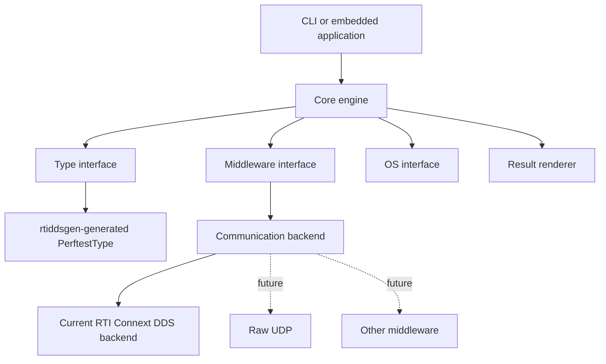

# Architecture

Perftest Lite separates benchmark logic from platform, type, middleware, and rendering details.

## Runtime flow

1. The application parses CLI arguments or initializes `PerftestLiteInputArgs` directly.
2. The core validates the selected type's reported/sample-size constraints.
3. The role-specific engine creates middleware endpoints and waits for its peer.
4. The publisher sends initialization traffic and then data. It marks periodic samples as pings, or every sample in strict latency mode.
5. The subscriber processes data, detects sequence gaps, and echoes initialization, ping, and finalization samples.
6. The publisher computes RTT/2 latency from pongs; the subscriber computes throughput and loss.
7. The selected renderer emits caller-owned result storage after the run.

## Boundaries

The core does not access generated DDS fields directly. `PerftestLiteTypeInterface` manages sample allocation, metadata, logical data length, and raw generated samples. `PerftestLiteMiddleware` owns Micro participant/entity lifecycle and receive/write mechanisms. `PerftestLiteOsInterface` owns time, sleep, semaphores, and NIC resolution.

The C API in `src/core/perftest_lite.h` is the application-facing surface.
`PerftestLiteOsInterface` is also a public source-level porting contract; its
`PERFTEST_LITE_OS_INTERFACE_VERSION` changes when an adapter requires source
updates. The middleware and type interfaces remain maintainer-facing extension
points without a public compatibility promise.
